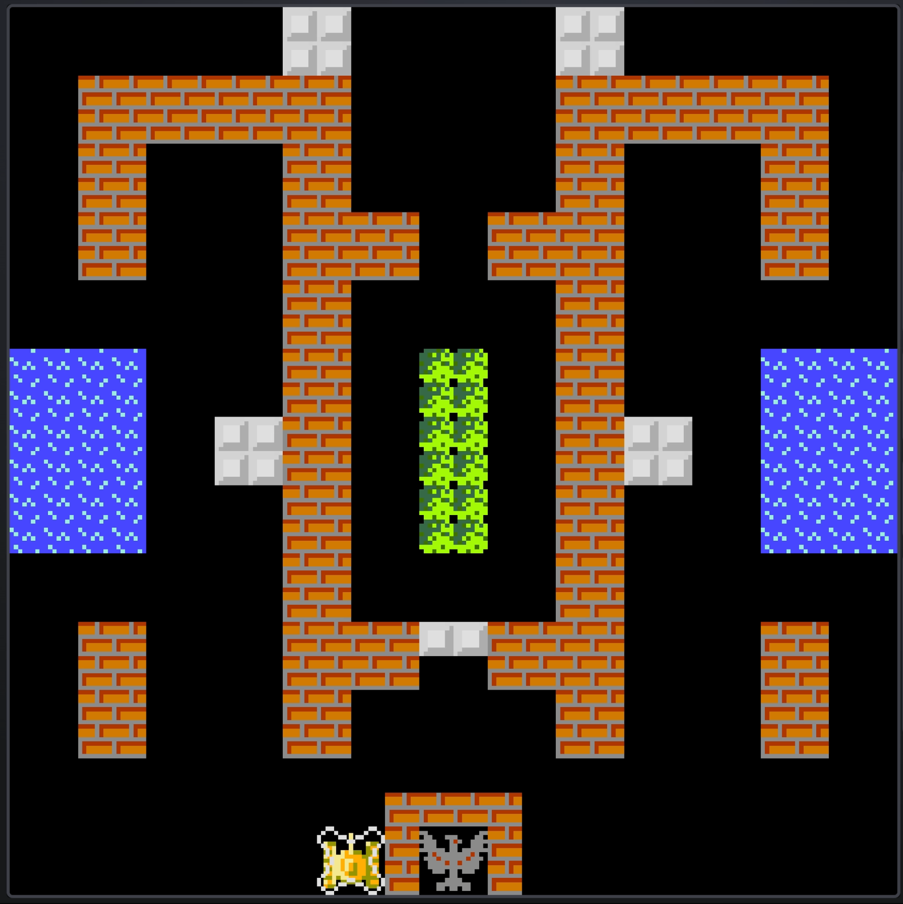

#  坦克大战 · Battle City

用纯前端技术栈复刻 NES 经典游戏 **Battle City**（坦克大战），支持单人、本地双人和 **WebRTC 联机双人**对战。

---

## ✨ 特性

- 🕹️ **三种游戏模式** — 单人闯关 / 本地双人 / 网络联机双人
- 🌐 **WebRTC P2P 联机** — 基于 DataChannel 的帧同步 + 可选画面串流模式
- 📱 **移动端适配** — 虚拟手柄 + 竖屏/横屏自动切换
- 🎮 **多输入支持** — 键盘三套方案（WASD / 方向键 / IJKL）+ Gamepad API 手柄 + 触屏
- 🗺️ **35 关卡** — 字符化关卡设计，涵盖砖墙、钢墙、水域、树丛、冰面等地形
- 🎁 **8 种道具** — 星星、加命、手雷、头盔、计时器、铲子、手枪、船
- 💥 **4 种敌人** — 普通、快速、火力、重甲（随血量变色）
- 🔊 **完整音效** — 射击、爆炸、道具、过关等
- 📺 **画面串流** — 联机时 Host 可通过 WebRTC Video 将画面推送给 Guest
- 🔗 **房间分享** — 通过 URL 参数一键邀请好友加入联机

---

## 🚀 快速开始

### 本地 / 局域网（不需要联机功能）

前端全部为静态文件，clone 后用任意静态服务器部署即可：

```bash
git clone https://github.com/Ksdb104/Battle_City
cd Battle_City

# 方式一：Nginx / Caddy 等指向此目录
# 方式二：快速预览
npx serve .
```

### 网络联机

WebRTC 要求 **HTTPS** 环境，并需要：

1. **信令服务器** — 负责房间管理和 SDP/ICE 交换  
2. **ICE 服务器** — STUN（NAT 穿透）/ TURN（中继转发）

本项目的信令服务器复用：  
👉 https://github.com/Ksdb104/WebRTCMeeting/tree/main/server

---

## ⚙️ 配置

### 信令服务器地址

编辑 `js/constants.js`：

```js
// 信令服务器地址（默认使用当前页面源地址）
signalingUrl: "",
```

留空则默认使用当前页面的源地址（适合信令服务器与游戏页面同域部署）。

### ICE 服务器

编辑 `js/netManager.js`：

```js
const config = {
  iceServers: [
    { urls: "stun:stun.cloudflare.com:3478" },   // Cloudflare 公共 STUN
    { urls: "stun:stun.l.google.com:19302" },    // Google 公共 STUN
    // 如需 TURN 中继（严格 NAT / 防火墙环境），添加：
    // { urls: "turn:your-server:3478", username: "user", credential: "pass" },
    // { urls: "turns:your-server:5349", username: "user", credential: "pass" },
  ],
};
```

> 💡 **提示**：公共 STUN 适合大部分家庭网络。如果玩家处于企业级防火墙或对称 NAT 后，需要部署 TURN 服务器（如 [coturn](https://github.com/coturn/coturn)）。

---

## 🎯 操作方式

| 设备 | 移动 | 开火 | Start | 暂停 |
|------|------|------|-------|------|
| **键盘 方案A** | W A S D | 空格 | Enter | P |
| **键盘 方案B** | ↑ ↓ ← → | Num1 | Num2 | P |
| **键盘 方案C** | I J K L | U | O | P |
| **手柄** | 摇杆 / 十字键 | A | Start | X |
| **触屏** | 虚拟十字键 | FIRE 按钮 | START 按钮 | PAUSE 按钮 |

本地双人时，先按 Start 的设备自动绑定为 P1，第二个设备加入为 P2。

---

## 🗺️ 关卡设计

使用字符网格定义地图（26×26 小格），一个字符对应一个 16×16 方块：

| 字符 | 地形 | 说明 |
|------|------|------|
| ` ` | 空地 | 可通行 |
| `B` | 砖墙 | 可被子弹摧毁 |
| `S` | 钢墙 | 仅高级子弹可破坏 |
| `W` | 水域 | 坦克无法通行，子弹可飞越 |
| `T` | 树丛 | 可通行，遮挡视野 |
| `I` | 冰面 | 坦克滑行 |
| `E` | 老鹰（基地） | 必须占 2×2 格，被摧毁则游戏结束 |

示例（第 3 关）：

```
  // ─── 第 3 关：水域 + 树林 ───
  [
    "        SS      SS        ",
    "        SS      SS        ",
    "  BBBBBBBB      BBBBBBBB  ",
    "  BBBBBBBB      BBBBBBBB  ",
    "  BB    BB      BB    BB  ",
    "  BB    BB      BB    BB  ",
    "  BB    BBBB  BBBB    BB  ",
    "  BB    BBBB  BBBB    BB  ",
    "        BB      BB        ",
    "        BB      BB        ",
    "WWWW    BB  TT  BB    WWWW",
    "WWWW    BB  TT  BB    WWWW",
    "WWWW  SSBB  TT  BBSS  WWWW",
    "WWWW  SSBB  TT  BBSS  WWWW",
    "WWWW    BB  TT  BB    WWWW",
    "WWWW    BB  TT  BB    WWWW",
    "        BB      BB        ",
    "        BB      BB        ",
    "  BB    BBBBSSBBBB    BB  ",
    "  BB    BBBB  BBBB    BB  ",
    "  BB    BB      BB    BB  ",
    "  BB    BB      BB    BB  ",
    "                          ",
    "           BBBB           ",
    "           BEEB           ",
    "           B  B           "
  ],
```



---

## 📁 项目结构

```
Battle_City_network/
├── index.html          # 入口页面
├── css/style.css       # 样式（响应式 + 移动端适配）
├── js/
│   ├── constants.js    # 常量、配置、工具函数
│   ├── input.js        # 输入系统（键盘/手柄/触屏）
│   ├── assets.js       # 资源加载
│   ├── audio.js        # 音频管理
│   ├── sprites.js      # 精灵渲染
│   ├── level.js        # 35 关关卡地图数据
│   ├── entities.js     # 游戏实体（坦克、子弹、道具）
│   ├── game.js         # 主游戏逻辑（状态机、碰撞、渲染）
│   ├── main.js         # 启动入口、主循环
│   ├── netManager.js   # WebRTC + Socket.IO 网络管理
│   ├── streamManager.js# 画面串流模块
│   ├── syncMessage.js  # 二进制消息编解码
│   └── inputBridge.js  # 联机输入桥接
├── img/                # 图片素材（坦克、地图、特效、道具、UI）
├── sound/              # 音效素材
├── level.png           # 关卡效果截图
└── level_code.png      # 关卡代码截图
```

## 🙏 致谢

- [feichao93/battle-city](https://github.com/feichao93/battle-city) — 敌人行动逻辑参考，部分音频素材来源

---

## 📜 License

MIT
